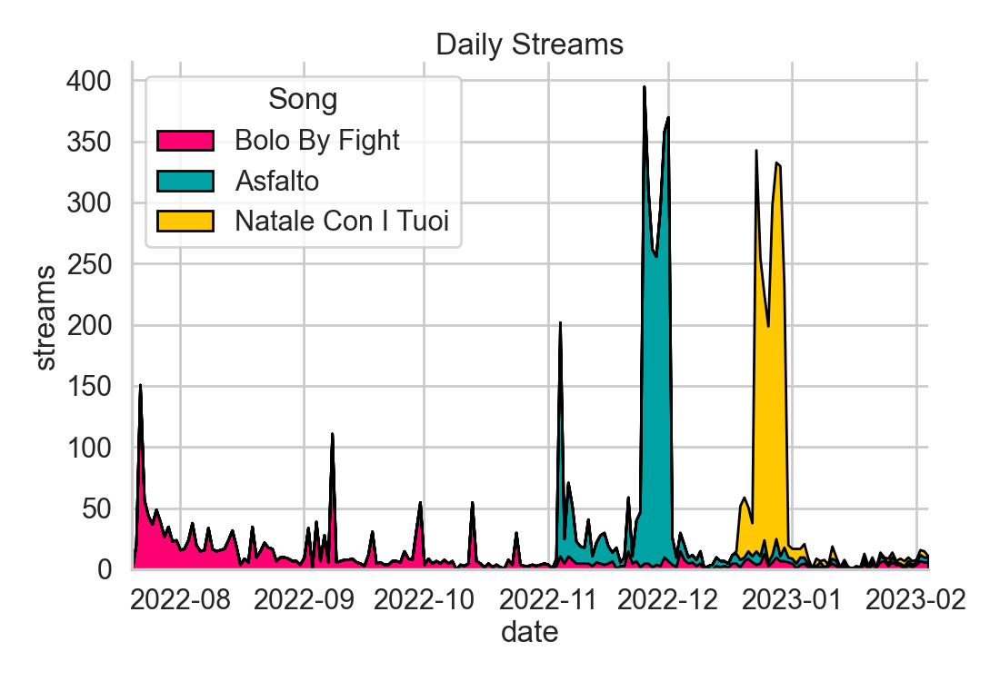

# SpotiViz: Data Visualization for Spotify Data

Code to generate the plots used in the Final Report for the PhD Course "Data Visualization for Scientists".

Data has been retrieved manually using the Spotify for Artists webpage of the
band [Divinae Miranda](https://open.spotify.com/artist/2wvpQCjOmseuzCLC9orKpn).

### Plot Example: Daily Streams

Represents the total daily streams, stacked by source song.

